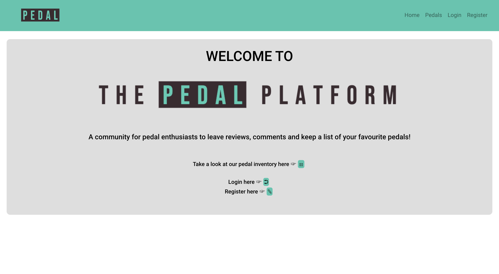
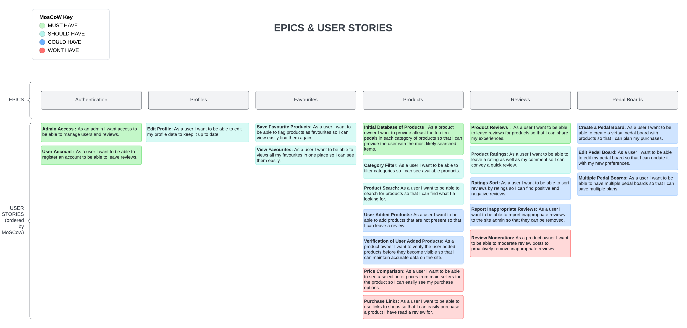
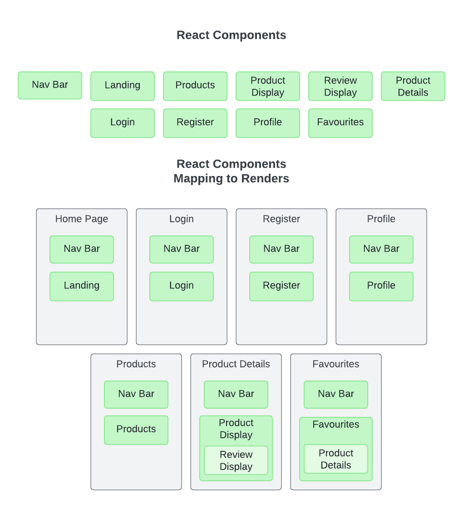
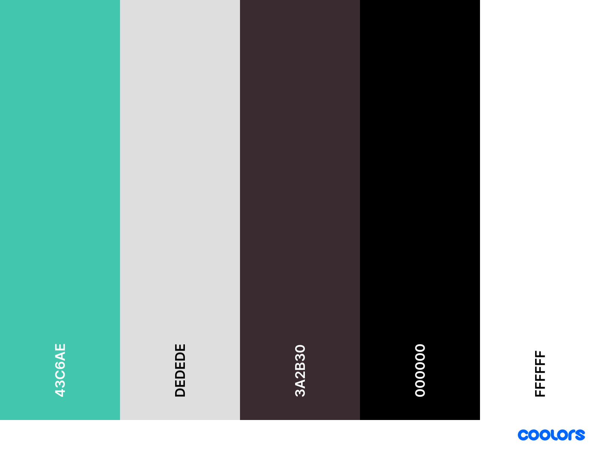
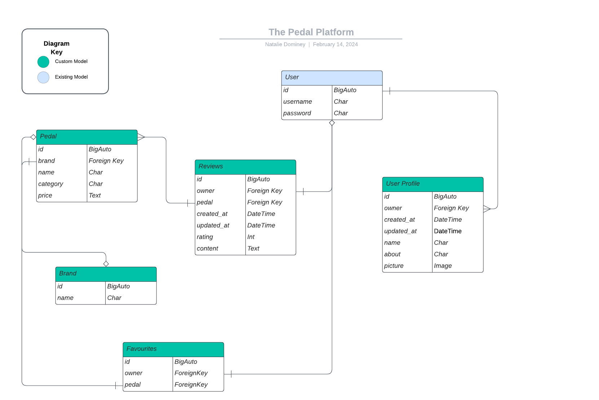

# The Pedal Platform

The Pedal Platform is an online resource for all lovers of Pedals. The admin on the sites maintain a database of pedal products to the community.

This database allows visitors to view reviews and ratings of their desired pedals. Those that create an account are able to leave reviews and save pedals in their favourites sections to curate there own selection!

The targeted audience is all who have a love of pedals and applying effects to their musical instruments be that guitars, keyboards, or drums.

Live Site - [The Pedal Platform](https://thepedalplatform-554a254bc88a.herokuapp.com/)  
Project Repository - [The Pedal Platform - Repository](https://github.com/NDOMINEY/thepedalplatform)

## Table of Contents

- [Requirements](#requirements "Requirements")
- [Agile Methods](#agile-methods "Agile Methods")
- [Design](#design "Design")
  - [Wireframes](#wireframes "Wireframes")
  - [React Components](#react-components "React Components")
  - [Colour Scheme](#colour-scheme "Colour Scheme")
- [Data Models](#data-models "Data Models")
- [API End Points](#api-end-points "API End Points")
- [Features](#features "Features")
  - [Existing Features](#existing-features "Existing Features")
  - [Future Features](#future-features "Future Features")
- [Testing](#testing "Testing")
  - [Development Process](#development-process "Development Process")
  - [Usability Testing](#usability-testing "Usability Testing")
  - [User Requirement Testing](#user-requirement-testing "User Requirement Testing")
  - [Functional Testing](#functional-testing "Functional Testing")
  - [Validator Testing](#validator-testing "Validator Testing")
  - [Automated Testing](#automated-testing "Automated Testing")
- [Technologies Used](#technologies-used "Technologies Used")
  - [Main Languages Used](#main-languages-used "Main Languages Used")
- [Deployment](#deployment "Deployment")
- [Credits](#credits "Credits")
  - [Content](#content "Content")
  - [Media](#media "Media")

## Requirements

Please see below a table showing the key requirements of the site and their importance.

| Requirement                                                                    | Importance | Viability/Feasibility |
| ------------------------------------------------------------------------------ | :--------: | :-------------------: |
| Have a clear and purposeful landing page displaying the purpose of the site    |     5      |           5           |
| Provide the vistors access to an arrange of pedal products                     |     5      |           5           |
| Allow vistors to filter view of pedals                                         |     5      |           5           |
| Allow vistors to create user accounts and add reviews and ratings for products |     5      |           5           |
| Allow users to save favourite pedals for future reference                      |     5      |           5           |
| Allow user to update profile information                                       |     5      |           5           |
| Provide a login link so user can easily login                                  |     5      |           5           |
| Enable logged in user to log out                                               |     5      |           5           |
| Allow vistors to be able to report a suspect review                            |     3      |           3           |
| Allow users to create virtual pedal board plans from the inventory of products |     2      |           1           |
| User to be able to request products to be added                                |     2      |           1           |
| Moderation for user generated content                                          |     1      |           1           |
| Provide price comparison and purchase links from agreed retailers              |     1      |           1           |

## Agile Methods

Through this object I have taken an agile approach to my development. To do this, I used the github issue and project board to organise my user stories. Please see link below.

[Agile Development - Project Board](https://github.com/users/NDOMINEY/projects/3)

Please see below Epics and User Stories which have been list by MoSCoW order. Link here for view of full document - [EPICS & USER STORIES](documentation/epics_userstories.png)

## Design

### Wireframes:

The below wireframe represents the concenpt idea at the initial planning stages. While the layouts and features remain mostly aligned to the deployed project,throughout the development and testing phases these were further refined. The wireframe also includes an additional 'could have' feature that has not made it into this stage of project deployment.

- Please find link to [Wireframes](documentation/wireframes.pdf)

### React Components:

With the wireframes created, I then mapped out and planned the use of React components and where I could re-use components for efficient and clean coding. This would also enable for future changes to be made in one place and rather than having to edit in multiple components.

### Colour Scheme:

With the aid of [Coolors - Palette Generator](https://coolors.co/) a colour scheme was curated that was mostly neutral with a bold colour that enables the site logo and call to action elements to the visitor clear.

## Data Models

The backend of this project had been created using Django Rest Framework.

Firstly, I started by assessing what models would be required to enable the main features of the site to function. I did this by creating a database diagram using [Lucid Chart](https://www.lucidchart.com/)

When implementing this using Django Rest Framework, I used supplied User model from the django.contrib.auth. I then created custom models for profiles, pedals, brands, reviews, and favourites.

## API End Points

Please see below a breakdown of the API end points that have been used throughout the productions of the project.

|            URL            |                                                                                  Function                                                                                   | HTTP Method             |        CRUD operation        |
| :-----------------------: | :-------------------------------------------------------------------------------------------------------------------------------------------------------------------------: | ----------------------- | :--------------------------: |
|      '/api/profiles/      |                                              Returns a list of all profiles. Able to be filtered by name, brand and category.                                               | GET                     |             Read             |
| '/api/profiles/<int:pk>'  | Returns the details of an exact user profile specified by its ID. This record is automatically created when a user registers. Owners and admin are able to edit the record. | GET, PUT                |       Read and Update        |
|      '/api/brands/'       |                                                                           Returns list of brands.                                                                           | GET                     |             Read             |
|  '/api/brands/<int:pk>'   |                                                Returns individual detail of brand record. Admin are able to edit and delete.                                                | GET, PUT, DELETE        | Create, Read, Update, Delete |
|       '/api/pedal/'       |                                                                       Returns list of pedal products.                                                                       | GET                     |             Read             |
|   '/api/pedal/<int:pk>'   |                                              Returns details of individual pedal products. Admin are able to edit and delete.                                               | GET, PUT, DELETE        | Create, Read, Update, Delete |
|     '/api/favourite/'     |                                Returns list of pedals that have been flagged as a favourite. This is able to be filtered by pedal and owner.                                | GET                     |             Read             |
| '/api/favourite/<int:pk>' |                                          Return individual favourite record. Owner and admin are able to create and delete record.                                          | GET, PUT, DELETE        |     Create, Read, Delete     |
|      '/api/review/'       |                                                           Returns list of reviews, able to be filtered by pedal.                                                            | GET                     |             Read             |
|  '/api/review/<int:pk>'   |                                           Returns individual review record. Owner and admin are able to update and delete record.                                           | GET, PUT, PATCH, DELETE | Create, Read, Update, Delete |

## Features

### Existing Features

#### Navigation Bar

##### Navigation bar - user not logged in

##### Navigation bar - user logged in

##### Navigation bar - hamburger view

##### Navigation bar - collapsed hamburger view

#### Home Page/Landing Page

#### About - Facilities

#### Contact Us

#### User Registration

#### User Login

#### User Logout

#### User Account

## Testing

### Development Process

### Usability Testing

### User Requirement Testing

### Functional Testing

### Validator Testing

#### Lighthouse

#### HTML Validator

HTML validator tests were carried out accross the site.

#### Python

Through the IDE pep8 compliance was checked to ensure the code was validated

### Automated Testing

# Technologies Used

- Whitenoise was used to serve the static files - [Whitenoise](https://whitenoise.readthedocs.io/en/stable/)
- Bootstrap was used for basic html styling - [Bootstrap](https://getbootstrap.com/)
- Elephantsql was used for the sites database - [ElephantSQL](https://customer.elephantsql.com/)

### Main Languages and Frameworks Used

- Python
- Javascript
- HTML5
- CSS3
- React

## Deployment

This site is deployed through Heruko. The following steps where followed within Heroku -

Whilst on the main dashboard, click 'Create new app'
Then enter the name of the project, select your region, and the click 'Create App'
Within the settings tab, you must update the 'Config Vars' to include the following: DATABASE_URL, DEBUG, HEROKU_POSTGRESQL_PURPLE_URL, SECRET_KEY.
Click 'Reveal Config Vars' to add.
In the deploy tab, under deployment method select 'GitHub'
Next search and connect to the correct repository from GitHub
Finally, scroll down towards the bottom and you will see 'Manual Deployment'. Select the branch you would like to deploy from and click 'Deploy Branch'. Once complete, you will be presented with a link to open the deployed site.
You can also set up auto deployments, this means Heroku will re-deploy the site every time you push an update to your GitHub repository.

#### Future development

To carry out further development on the project you can clone the repository locally. This is completed by carrying out the following steps -

Within your repository, make sure you are on the 'Code' tab
Click on the button that shows '<> Code'
Then select how you wish to clone
To create an isolated version of the project, you may add a branch off of main. To do this follow the below steps -

Whilst in the code section, click on 'branch'
You will then see a breakdown of the exisiting branches
To add a new branch, click 'New Branch' which is a green button
Then name your branch and select the branch source

## Credits

### Content

### Media

#### Images

#### Logo

The logo was created using [Adobe Express](https://www.adobe.com/express/create/logo/website)
