# The Pedal Platform

The Pedal Platform is an online resource for all lovers of Pedals. The admin on the sites maintain a database of pedal products to the community.

This database allows visitors to view reviews and ratings of their desired pedals. Those that create an account are able to leave reviews and save pedals in their favourites sections to curate there own selection!

The targeted audience is all who have a love of pedals and applying effects to their musical instruments be that guitars, keyboards, or drums.


Live Site - [The Pedal Platform](https://thepedalplatform-554a254bc88a.herokuapp.com/) <br>
Project Repository - [The Pedal Platform - Repository](https://github.com/NDOMINEY/thepedalplatform)

## Table of Contents

- [Requirements](#requirements "Requirements")
- [Agile Methods](#agile-methods "Agile Methods")
- [Design](#design "Design")
  - [Wireframes](#wireframes "Wireframes")
  - [React Components](#react-components "React Components")
  - [Colour Scheme](#colour-scheme "Colour Scheme")
- [Data Models](#data-models "Data Models")
- [API End Points](#api-end-points "API End Points")
- [Features](#features "Features")
  - [Existing Features](#existing-features "Existing Features")
  - [Future Features](#future-features "Future Features")
- [Testing](#testing "Testing")
  - [Development Process](#development-process "Development Process")
  - [Usability Testing](#usability-testing "Usability Testing")
  - [User Requirement Testing](#user-requirement-testing "User Requirement Testing")
  - [Functional Testing](#functional-testing "Functional Testing")
  - [Validator Testing](#validator-testing "Validator Testing")
  - [Automated Testing](#automated-testing "Automated Testing")
- [Technologies Used](#technologies-used "Technologies Used")
  - [Main Languages Used](#main-languages-used "Main Languages Used")
- [Deployment](#deployment "Deployment")
- [Credits](#credits "Credits")
  - [Content](#content "Content")
  - [Media](#media "Media")

## Requirements

Please see below a table showing the key requirements of the site and their importance.

| Requirement                                                                    | Importance | Viability/Feasibility |
| ------------------------------------------------------------------------------ | :--------: | :-------------------: |
| Have a clear and purposeful landing page displaying the purpose of the site    |     5      |           5           |
| Provide the vistors access to an arrange of pedal products                     |     5      |           5           |
| Allow vistors to filter view of pedals                                         |     5      |           5           |
| Allow vistors to create user accounts and add reviews and ratings for products |     5      |           5           |
| Allow users to save favourite pedals for future reference                      |     5      |           5           |
| Allow user to update profile information                                       |     5      |           5           |
| Provide a login link so user can easily login                                  |     5      |           5           |
| Enable logged in user to log out                                               |     5      |           5           |
| Allow vistors to be able to report a suspect review                            |     3      |           3           |
| Allow users to create virtual pedal board plans from the inventory of products |     2      |           1           |
| User to be able to request products to be added                                |     2      |           1           |
| Moderation for user generated content                                          |     1      |           1           |
| Provide price comparison and purchase links from agreed retailers              |     1      |           1           |

## Agile Methods

Through this object I have taken an agile approach to my development. To do this, I used the github issue and project board to organise my user stories. Please see link below.

[Agile Development - Project Board](https://github.com/users/NDOMINEY/projects/3)

Please see below Epics and User Stories which have been list by MoSCoW order. Link here for view of full document - [EPICS & USER STORIES](documentation/epics_userstories.png)


## Design

### Wireframes:

The below wireframe represents the concenpt idea at the initial planning stages. While the layouts and features remain mostly aligned to the deployed project,throughout the development and testing phases these were further refined. The wireframe also includes an additional 'could have' feature that has not made it into this stage of project deployment.

- Please find link to [Wireframes](documentation/wireframes.pdf)

### React Components:

With the wireframes created, I then mapped out and planned the use of React components and where I could re-use components for efficient and clean coding. This would also enable for future changes to be made in one place and rather than having to edit in multiple components.


### Colour Scheme:

With the aid of [Coolors - Palette Generator](https://coolors.co/) a colour scheme was curated that was mostly neutral with a bold colour that enables the site logo and call to action elements to the visitor clear.


## Data Models

The backend of this project had been created using Django Rest Framework.

Firstly, I started by assessing what models would be required to enable the main features of the site to function. I did this by creating a database diagram using [Lucid Chart](https://www.lucidchart.com/)


When implementing this using Django Rest Framework, I used supplied User model from the django.contrib.auth. I then created custom models for profiles, pedals, brands, reviews, and favourites.

## API End Points

Please see below a breakdown of the API end points that have been used throughout the productions of the project.

|            URL            |                                                                                  Function                                                                                   | HTTP Method             |        CRUD operation        |
| :-----------------------: | :-------------------------------------------------------------------------------------------------------------------------------------------------------------------------: | ----------------------- | :--------------------------: |
|      '/api/profiles/      |                                              Returns a list of all profiles. Able to be filtered by name, brand and category.                                               | GET                     |             Read             |
| '/api/profiles/<int:pk>'  | Returns the details of an exact user profile specified by its ID. This record is automatically created when a user registers. Owners and admin are able to edit the record. | GET, PUT                |       Read and Update        |
|      '/api/brands/'       |                                                                           Returns list of brands.                                                                           | GET                     |             Read             |
|  '/api/brands/<int:pk>'   |                                                Returns individual detail of brand record. Admin are able to edit and delete.                                                | GET, PUT, DELETE        | Create, Read, Update, Delete |
|       '/api/pedal/'       |                                                                       Returns list of pedal products.                                                                       | GET                     |             Read             |
|   '/api/pedal/<int:pk>'   |                                              Returns details of individual pedal products. Admin are able to edit and delete.                                               | GET, PUT, DELETE        | Create, Read, Update, Delete |
|     '/api/favourite/'     |                                Returns list of pedals that have been flagged as a favourite. This is able to be filtered by pedal and owner.                                | GET                     |             Read             |
| '/api/favourite/<int:pk>' |                                          Return individual favourite record. Owner and admin are able to create and delete record.                                          | GET, PUT, DELETE        |     Create, Read, Delete     |
|      '/api/review/'       |                                                           Returns list of reviews, able to be filtered by pedal.                                                            | GET                     |             Read             |
|  '/api/review/<int:pk>'   |                                           Returns individual review record. Owner and admin are able to update and delete record.                                           | GET, PUT, PATCH, DELETE | Create, Read, Update, Delete |

## Features

### Existing Features

#### Navigation Bar

Present on each page is the NavBar component (NavBar.js) which contains the site logo and links to various areas of the site. The logo acts as a link to the home page as well as a direct "Home" page button. Also there is the "Pedal" link which is present for all visitors which takes the user to the main product page.

The NavBar will determine whether the is a user currently logged in. If so it will provide links that allow the user to go to their Profile and Favourites page, as well as log out. If there is no user, then a login and register link will appear.

##### Navigation bar - user not logged in


##### Navigation bar - user logged in

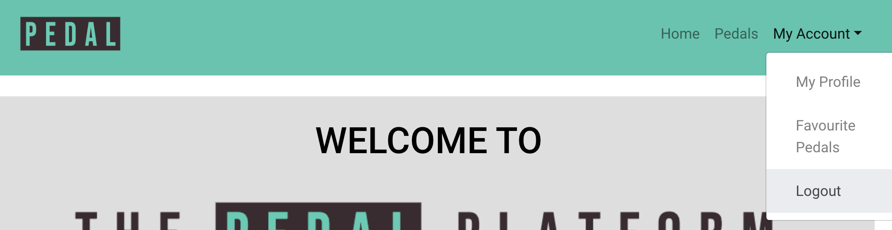

##### Navigation bar - hamburger view

For responsive design, when the screen becomes small the navigation links change to a hamburger menu.


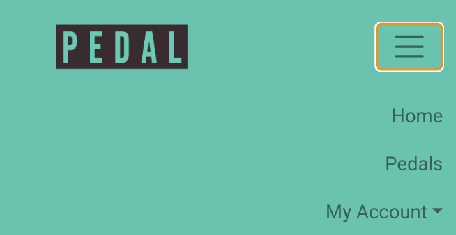

#### Home Page/Landing Page

When the site is loaded from the root file, landing component (Landing.js) is displayed to the user. Within this component, a clear full logo of the site is shown to welcome the user and to clearly demonstrate the purpose of the site. This is followed by a brief description to further detail this, with a link to the primary feature of the product page (Products.js).


If the there is no current user logged in, then links to login and register will also be present.

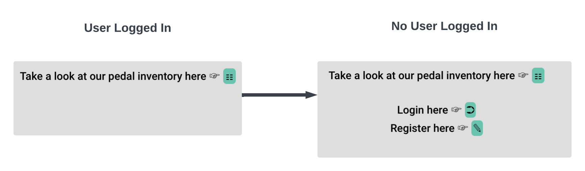

#### Products

The main feature of the site is a directory of products for the visitor to view and see reviews and ratings. The products page (Products.js), features a search and filter section which will provide the user a means to narrow down their search if required.

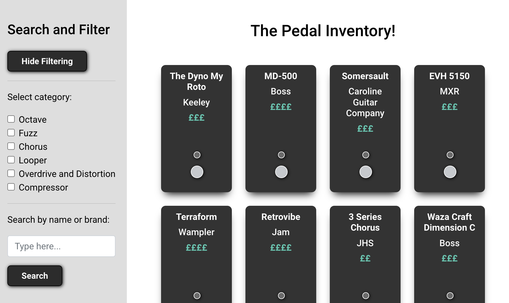

Along side this, is a display of all of the products. To compliment the theme of the site, rather than a list of products, they are displayed as mini pedals using css design. To make the pedals responsive to user interaction, when an element is hovered over the pedal light 'turns on' and changes to a red colour to feed this back to the user.

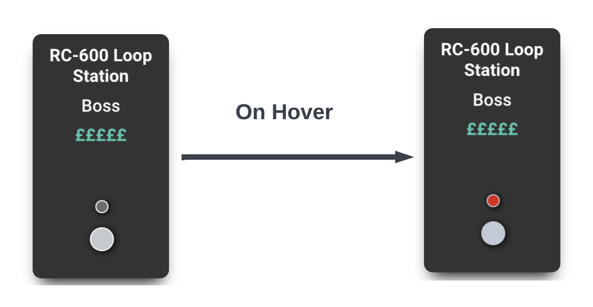

Due to the length of the page caused by large amount of products when unfiltered, a button has been added to allow the user to go straight to the top of the page if needed.

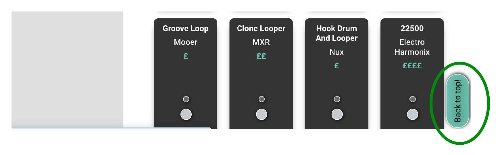

#### Product Detail

When a pedal is clicked from the products page, it loads the product details component (ProductDetail.js which also has the ReviewDisplay.js component nested). This shows the details of that specific product and all linked reviews. If there are no reviews, it will states there is currently none.

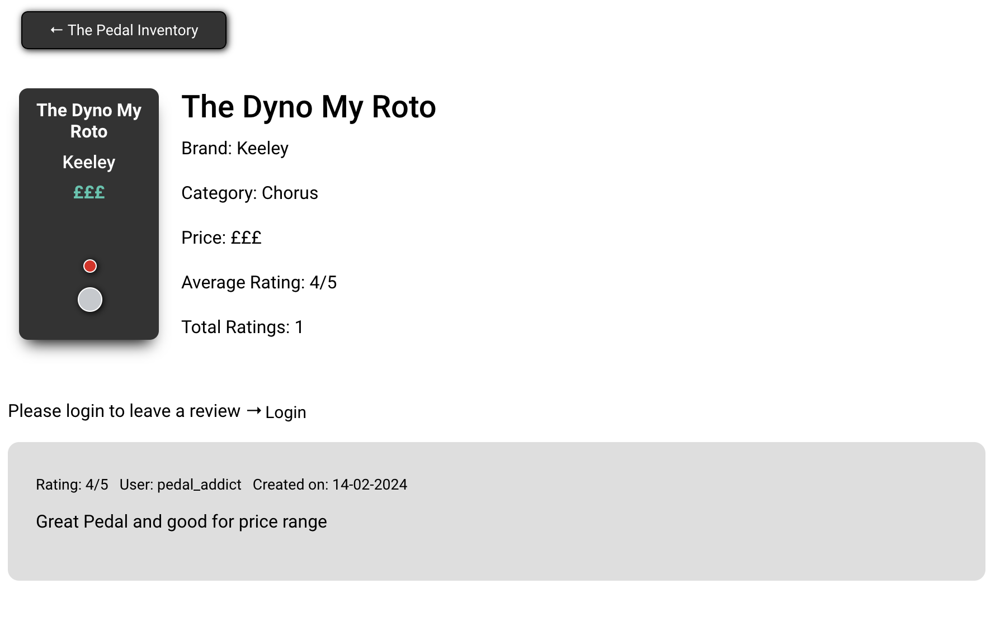

As seen above, when no user is logged in, between the pedal display and the reviews is a prompt for the user to login to add reviews. Once the user has logged in they will be able to complete a form to add a review to the product.

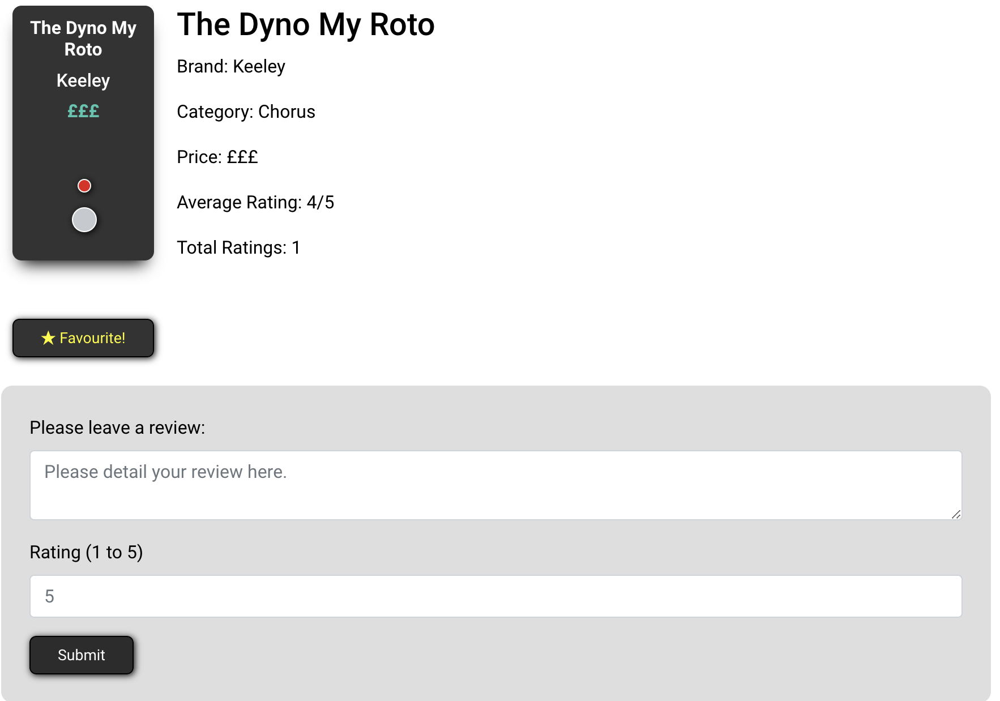

Additionally, once a user is logged in, they are able to toggle between adding and removing the product from their favourites list.

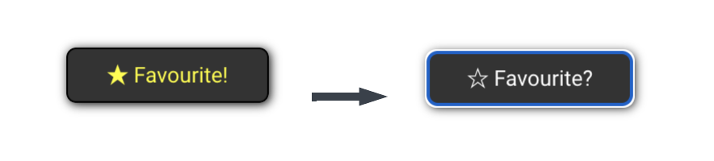

#### User Registration

When the register linked is selected, the Register Form component is loaded (RegisterForm.js). This allowed the user to create a login using the dj-rest-auth framework. Upon succesful submission, the user is the diverted to the login page.

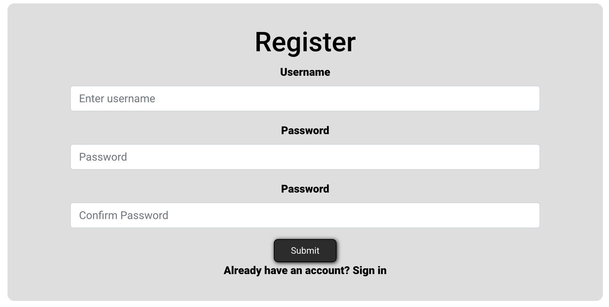

When the data is not correct on the form, this is fed back to the user.

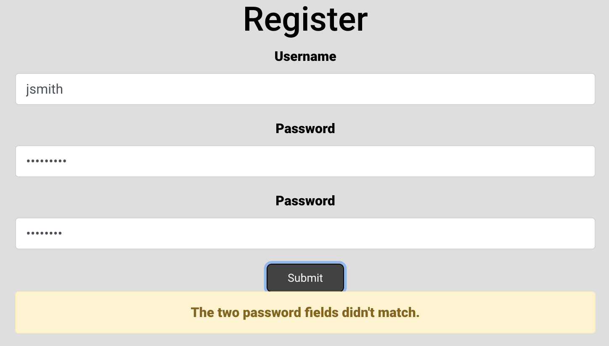

#### User Login

Similarly to the register component, when login is selected the login component is rendered to the user.

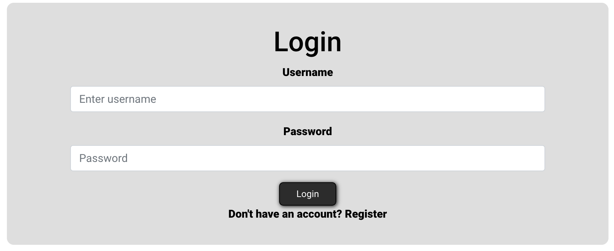

#### User Logout

The logout process is carried out by the user clicking the logout link from the NavBar. This link then triggers a function that sends an api request to "dj-rest-auth/logout" to log the user out. Once complete the user is the diverted back to the home page.

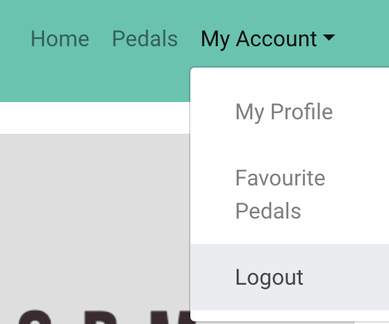

#### User Profile

When logged in, the user is able to view and edit their profile details. This includes their name and a section about them.
Each profile contains a default image and from the profile component, the user is also able to upload a profile image of their choice. This media is stored using cloudinary.

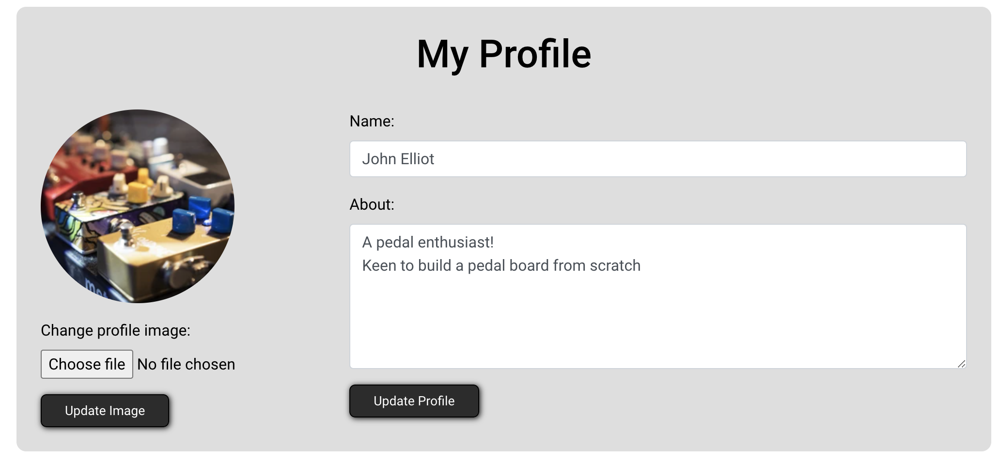

#### User Favourites

Another function available to users is to view products they have added to their favourites. This renders from the Favourites components (Favourites.js) and displays the pedals in the same style as the products page. The user is able to click on a product from this and it directs the user to the products individual detail page.

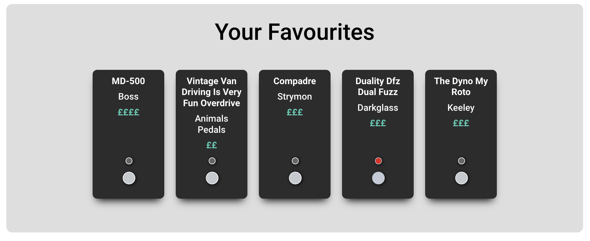

## Testing

### Development Process

Whilst developing, new features and styling changes where tested locally to ensure the code was working as intended before being added to the main branch of the repository. Once I was satisified that the new code was working as intended, I would then commit, and push to main so that it could be tested in the deployed environment.

Testing it locally enabled me to take advantage of the debug mode to help fix bugs and refactor the code.

Viewing the changes in realtime through localhost also provided instant feedback on css inpact on styling. This was particularly usful in applying the styling hierachy to customise the React Bootstrap when necessary. Although not best practice, in some instances I had to use !important to overide button styling.

### Usability Testing

The site has been designed to be clear and easy to read. A neutral colour scheme, with an accent colour, enabled me to keep texts clear against the background. The accent colour has also been used to signpost users on the home page to make inital navigation to the sites main features intuitive to the user.

The site also has a responsive design which means it is usuable for users accross an array of screen sizes. This allows for use accross multiple devices rather than restricting to desktop use only.

### User Requirement Testing

To ensure that the site met the essential requirements of the user, the following user cases were formed and then tested within the functional tests. Below is a table which details the user cases, tests that relate and whether it passes.

| User Case | Description                                                                                        | Relevant test cases                                    | Result |
| --------- | -------------------------------------------------------------------------------------------------- | ------------------------------------------------------ | ------ |
| UC-001    | As a user I want to be presented with a clear landing page to inform me of the purpose of the site | TC-001, TC-002                                         | Pass   |
| UC-002    | As a user I want to be able to view a directory of products available                              | TC-005, TC-009                                         | Pass   |
| UC-003    | As a user I want to be able to be able to filter the products to narrow my searches                | TC-012, TC-013, TC-014                                 | Pass   |
| UC-004    | As a user I want to be able to view ratings and reviews for products                               | TC-015, TC-016, TC-017, TC-018, TC-019, TC-023         | Pass   |
| UC-005    | As a user I would like to be able to register for an account and login                             | TC-006, TC-007, TC-010, TC-012                         | Pass   |
| UC-006    | As a user I would like to be able to add reviews to products                                       | TC-015, TC-016, TC-020, TC-021, TC-022, TC-023         | Pass   |
| UC-007    | As a user I would like to be able to edit and delete my reviews                                    | TC-015, TC-016, TC-019, TC-024, TC-025, TC-026, TC-027 | Pass   |
| UC-008    | As a user I would like to be able to edit my profile information                                   | TC-008, TC-033, TC-034, TC-035                         | Pass   |
| UC-009    | As a user I would like to be able to save products to a favourites list and view them              | TC-008, TC-015, TC-016, TC-028, TC-030, TC-031         | Pass   |
| UC-010    | As a user I would like to be able to remove products from my favourites                            | TC-015, TC-016, TC-029                                 | Pass   |
| UC-011    | As a user I would like to be able to log out                                                       | TC-008, TC-036                                         | Pass   |
| UC-012    | As an admin I would like access to an admin account to edit data in the database                   | TC-037, TC-038, TC-039                                 | Pass   |

### Functional Testing

Upon deployment through heroku, a total of 39 functional tests were carried out to ensure the website functioned correctly.

Please expand 'Functional Test Cases' below to see a breakdown of the tests carried out.

<details>

<summary>Functional Test Cases</summary>

| Test Case | Description                                                                                                                          | Pre Conditions                                                                                | Steps to Executed                                                                                                                                                                                | Result | Comments |
| --------- | ------------------------------------------------------------------------------------------------------------------------------------ | --------------------------------------------------------------------------------------------- | ------------------------------------------------------------------------------------------------------------------------------------------------------------------------------------------------ | ------ | -------- |
| TC-001    | Website Landing Page - Home page loads when index.html is loaded                                                                     | N/A                                                                                           | 1. Open browser 2. Enter website URL 3. Check home page is loaded                                                                                                                                | Pass   |          |
| TC-002    | Website Landing Page - The home page displays the main logo and provides information regarding the purpose of the site               | Home Page is loaded                                                                           | 1. Check Homes Page is loaded 2. Check that full site logo is clearly displayed 3. Check that information is presented to the user that explain the purpose of the site                          | Pass   |          |
| TC-003    | Navigation Menu - Logo renders home page when clicked                                                                                | Home Page is loaded                                                                           | 1. Check Homes Page is loaded 2. Click on logo in NavBar 3. Check that the home page rendered                                                                                                    | Pass   |          |
| TC-004    | Navigation Menu - Home link rendered home page when clicked                                                                          | Home Page is loaded                                                                           | 1. Check Homes Page is loaded 2. Click on ‘Home’ link in NavBar 3. Check that the home page rendered                                                                                             | Pass   |          |
| TC-005    | Navigation Menu - Pedals link rendered products page when clicked                                                                    | Home Page is loaded                                                                           | 1. Check Homes Page is loaded 2. Click on ‘Pedals’ link in NavBar 3. Check that the products page rendered                                                                                       | Pass   |          |
| TC-006    | Navigation Menu - Login link renders login page when clicked                                                                         | Home Page is loaded and no user is logged in                                                  | 1. Check Homes Page is loaded 2. Click on ‘Login’ link in NavBar 3. Check that the login page rendered                                                                                           | Pass   |          |
| TC-007    | Navigation Menu - Register link renders register page when clicked                                                                   | Home Page is loaded and no user is logged in                                                  | 1. Check Homes Page is loaded 2. Click on ‘Register’ link in NavBar 3. Check that the register page rendered                                                                                     | Pass   |          |
| TC-008    | Navigation Menu - MyAccount link expands to user specific links for Profile, Favourites and Logout                                   | Home Page is loaded and user is logged in                                                     | 1. Check Homes Page is loaded 2. Click on ‘My Account’ button in NavBar 3. Check that drop down menu appears showing Profiles, Favourites and Logout                                             | Pass   |          |
| TC-009    | Website Landing Page - Products Link renders product page                                                                            | Home Page is loaded                                                                           | 1. Check Homes Page is loaded 2. Click on link to Products in body of landing component 3. Check that products page rendered                                                                     | Pass   |          |
| TC-010    | Website Landing Page - Login Link renders Login page                                                                                 | Home Page is loaded and user is not logged in                                                 | 1. Check Homes Page is loaded 2. Click on link to Login in body of landing component 3. Check that Login page rendered                                                                           | Pass   |          |
| TC-011    | Website Landing Page - Register Link renders Register page                                                                           | Home Page is loaded and user is not logged in                                                 | 1. Check Homes Page is loaded 2. Click on link to Register in body of landing component 3. Check that Register page rendered                                                                     | Pass   |          |
| TC-012    | Product Page - Products list updates when categories are ticked in filtering section                                                 | Products page is loaded                                                                       | 1. Check Products Page is loaded 2. For each category alternate through selecting each individual option 3. Check that for each category clicked that the correct pedals render                  | Pass   |          |
| TC-013    | Product Page - Products list updates when multiple categories are ticked in filtering section                                        | Products page is loaded                                                                       | 1. Check Products Page is loaded 2. Select multiple categories at once in the filter section 3. Check that the correct categories are displayed in the products                                  | Pass   |          |
| TC-014    | Product Page - Products list updates when text is entered and submitted through the name and brand search                            | Products page is loaded                                                                       | 1. Check Products Page is loaded 2. Test multiple variations of brands and product names 3. Check that the correct pedals are filter in the display                                              | Pass   |          |
| TC-015    | Product Page - Links to individual pedals renders the appropriate pedal detail page                                                  | Products page is loaded                                                                       | 1. Check Products Page is loaded 2. For multiple products, click the individual pedal display link 3. Check that for each link followed, the page rendered the targeted pedals details display   | Pass   |          |
| TC-016    | Product Detail Page - Check correct pedal information has rendered                                                                   | Pedal link has been clicked from products page                                                | 1. Check the pedal detail page loaded is correct to the link clicked in the previous step                                                                                                        | Pass   |          |
| TC-017    | Product Detail Page - Average ratings and review stats are displayed                                                                 | Pedal Detail Page is loaded                                                                   | 1. Check that ratings averages are displayed relating to the targeted pedal for the page                                                                                                         | Pass   |          |
| TC-018    | Product Detail Page - If no reviews are present for pedal, relay this to the user                                                    | Pedal Detail Page is loaded and there are no reviews for the pedal                            | 1. Check Products Details page is loaded 2. Check that below the pedal information, it states no reviews for pedal                                                                               | Pass   |          |
| TC-019    | Product Detail Page - Where reviews are available, they are detailed below the main product information                              | Pedal Detail Page is loaded and there are reviews for the pedal                               | 1. Check Products Details page is loaded 2. Check that the reviews are rendered below the pedal information                                                                                      | Pass   |          |
| TC-020    | Product Detail Page - When user is not logged in, a prompt to login to leave review is given. This provides a link to the login page | Pedal Detail Page is loaded and the user is logged out                                        | 1. Check Products Details page is loaded 2. Check prompt shows for site user to login to leave a review                                                                                          | Pass   |          |
| TC-021    | Product Detail Page - When user is logged in, form is available to be completed to submit review                                     | Pedal Detail Page is loaded and the user is logged in                                         | 1. Check Products Details page is loaded 2. Check form is present to submit product review                                                                                                       | Pass   |          |
| TC-022    | Product Detail Page - When review form is completed you are able to successfully submit                                              | Pedal Detail Page is loaded and the user is logged in                                         | 1. Check Products Detail Page is loaded 2. Complete a review form 3. Confirm submission is successful                                                                                            | Pass   |          |
| TC-023    | Product Detail Page - Upon review submission, the review components re-render to update                                              | Pedal Detail Page is loaded and the user is logged in and has submitted a review              | 1. Check Products Detail Page is loaded 2. On form submission, check the review component has re-rendered and new review is displayed                                                            | Pass   |          |
| TC-024    | Product Detail Page - Owner is able to edit their review submission                                                                  | Pedal Detail Page is loaded, the user is logged in and has submitted a review                 | 1. Check Products Detail Page is loaded 2. Locate review in list that the user owns 3. Check that button is present for the user to edit                                                         | Pass   |          |
| TC-025    | Product Detail Page - Owner is able to edit their review submission and submit new data                                              | Pedal Detail Page is loaded, the user is logged in and has submitted a review                 | 1. Check Products Detail Page is loaded 2. Locate review in list that the user owns 3. Click the edit button and submit a change 4. Check the records reflect the change                         | Pass   |          |
| TC-026    | Product Detail Page - Owner is able to delete their review submission                                                                | Pedal Detail Page is loaded, the user is logged in and has submitted a review                 | 1. Check Products Detail Page is loaded 2. Locate review in list that the user owns 3. Check that button is present for the user to delete                                                       | Pass   |          |
| TC-027    | Product Detail Page - Owner is able to successfully delete their review                                                              | Pedal Detail Page is loaded, the user is logged in and has submitted a review                 | 1. Check Products Detail Page is loaded 2. Locate review in list that the user owns 3. Click the delete button and confirm request 4. Check the records reflect that the review has been deleted | Pass   |          |
| TC-028    | Product Detail Page - User is able to click the Favourite button to add the pedal to their list                                      | Pedal Detail Page is loaded, the user is logged in and has not added the pedal as a favourite | 1. Check Products Detail Page is loaded 2. Click Favourite Button 3. Check that pedal has been added to favourite list                                                                           | Pass   |          |
| TC-029    | Product Detail Page - User is able to click the Favourite button to remove the pedal from their list                                 | Pedal Detail Page is loaded, the user is logged in and has added the pedal as a favourite     | 1. Check Products Detail Page is loaded 2. Click Favourite Button 3. Check that pedal has been removed from favourite list                                                                       | Pass   |          |
| TC-030    | Favourites Page - User is able to view all products they have marked as a favourite                                                  | User is logged in and Favourites page is loaded                                               | 1. Check Favourites Page is loaded 2. Check all products that have been added as a favourite have rendered                                                                                       | Pass   |          |
| TC-031    | Favourites Page - All pedals displayed link to their corresponding products detail page                                              | User is logged in and Favourites page is loaded                                               | 1. Check Favourites Page is loaded 2. Click on pedal link 3. Check that targeted product detail page is rendered                                                                                 | Pass   |          |
| TC-032    | Favourites Page - All pedals link to their corresponding products detail page                                                        | User is logged in and Favourites page is loaded                                               | 1. Check Favourites Page is loaded 2. Click on pedal link 3. Check that targeted product detail page is rendered                                                                                 | Pass   |          |
| TC-033    | Profile Page - Profile edit form rendered auto filled with held information                                                          | User is logged in and Profile page is loaded                                                  | 1. Check Profile Page is loaded 2. Check that profile picture, name and about forms are rendered 3. Check that the fields display the currently held data in the database                        | Pass   |          |
| TC-034    | Profile Page - Upload a different profile picture and save to record                                                                 | User is logged in and Profile page is loaded                                                  | 1. Check Profile Page is loaded 2. Upload a new image to the profile image form 3. Click submit and check the records are updated                                                                | Pass   |          |
| TC-035    | Profile Page - Amend name and about field in profile                                                                                 | User is logged in and Profile page is loaded                                                  | 1. Check Profile Page is loaded 2. Change the text in name and about form fields 3. Click submit and check the records are updated                                                               | Pass   |          |
| TC-036    | Logout - User is logged out when link is clicked from NavBar                                                                         | User is logged in                                                                             | 1. From NavBar, click the logout link 2. Confirm user has been logged out and returned to home page                                                                                              | Pass   |          |
| TC-037    | Admin - check that /admin loads the admin login                                                                                      | No user is logged in                                                                          | 1. In URL add ‘/admin’ and enter 2. Check the admin page has loaded                                                                                                                              | Pass   |          |
| TC-038    | Admin - Admin login has access to view all models                                                                                    | Admin logged in and in ‘/admin’                                                               | 1. Check ‘/admin’ has loaded and admin is logged in 2. Check admin is able to view all models                                                                                                    | Pass   |          |
| TC-039    | Admin - Admin login is able to create, update and delete records                                                                     | Admin logged in and in ‘/admin’                                                               | 1. Check ‘/admin’ has loaded and admin is logged in 2. Check admin is able to create, update and delete records                                                                                  | Pass   |          |

</details>

<br>

### Validator Testing

#### Lighthouse

I carried out lighthouse testing on each page to check for areas of improvements. As a result of these checks I carried out the following changes:

- Background grey container contrast not high enough compared to text, I therefore added transparency to this to improve readability.
- Screen reader issues on multiple buttons used for product display list, resolved by adding aria-label's
- HTML headers not used in consecutive order, html adjusted to reflect correct application

PDF's below:

- [Home](documentation/lighthouse_home.pdf)
- [Product Inventory](documentation/lighthouse_product.pdf)
- [Product Detail](documentation/lighthouse_pedal_detail.pdf)
- [Profile](documentation/lighthouse_profile.pdf)
- [Favourites](documentation/lighthouse_favourites.pdf)

#### HTML Validator

HTML validator tests were carried out accross the site.

#### Python

Through the IDE pep8 compliance was checked to ensure the code was validated

### Automated Testing

Provided with further time, I would like to add automated testing to test the API End Points worked correctly. Instead, this had been extensively tested manually.

# Technologies Used

- Whitenoise was used to serve the static files - [Whitenoise](https://whitenoise.readthedocs.io/en/stable/)
- Bootstrap was used for basic html styling - [Bootstrap](https://getbootstrap.com/)
- Elephantsql was used for the sites database - [ElephantSQL](https://customer.elephantsql.com/)
- Cloudinary was used to store media files - [Cloudinary](https://cloudinary.com/)

### Main Languages and Frameworks Used

- Python
- Django Rest Framework
- React
- Javascript
- JSX to write HTML im React
- CSS
- Node Package Manager
- Eslint - linting tool

## Deployment

As the backend (DRF) and frontend (REACT APP) are within the same repository, when any changes are made within the front end folder the static files need to be deleted and recreated to capture all of the updated. This can be done via the following commands with the terminal -

```
cd frontend
npm run build && rm -rf ../staticfiles/build && mv build ../staticfiles/.
```

This site is deployed through Heruko. The following steps where followed within Heroku -

Whilst on the main dashboard, click 'Create new app'
Then enter the name of the project, select your region, and the click 'Create App'
Within the settings tab, you must update the 'Config Vars' to include the following: DATABASE_URL, HEROKU_POSTGRESQL_PURPLE_URL, SECRET_KEY.
Click 'Reveal Config Vars' to add.
In the deploy tab, under deployment method select 'GitHub'
Next search and connect to the correct repository from GitHub
Finally, scroll down towards the bottom and you will see 'Manual Deployment'. Select the branch you would like to deploy from and click 'Deploy Branch'. Once complete, you will be presented with a link to open the deployed site.
You can also set up auto deployments, this means Heroku will re-deploy the site every time you push an update to your GitHub repository.

#### Future development

To carry out further development on the project you can clone the repository locally. This is completed by carrying out the following steps -

Within your repository, make sure you are on the 'Code' tab
Click on the button that shows '<> Code'
Then select how you wish to clone
To create an isolated version of the project, you may add a branch off of main. To do this follow the below steps -

Whilst in the code section, click on 'branch'
You will then see a breakdown of the exisiting branches
To add a new branch, click 'New Branch' which is a green button
Then name your branch and select the branch source

## Credits

### Content

Font provided by [Google Fonts](https://fonts.google.com/)
Button's styled through [CSS Button Creator](https://cssbuttoncreator.com/)
Text areas on form tutorial by [Tutorials Point](https://www.tutorialspoint.com/How-to-Create-a-Multi-line-Text-Input-Text-Area-In-HTML)
Scroll to top button tutorial and code provided by [Geeks for Geeks](https://www.geeksforgeeks.org/how-to-create-a-scroll-to-top-button-in-react-js/)
Table in README provided by [Tablesgenerator](https://www.tablesgenerator.com/markdown_tables#)

### Media

#### Images

Loading gif provided by [Pixabay](https://pixabay.com/users/ekkant-33254754/)

#### Logo

The logo was created using [Adobe Express](https://www.adobe.com/express/create/logo/website)
